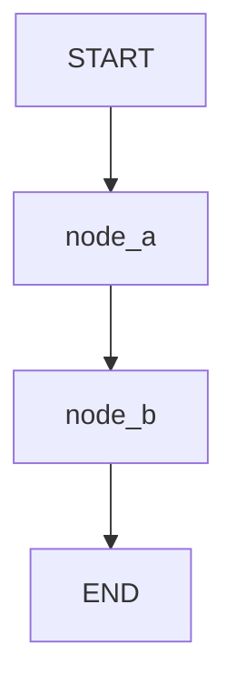

# Graphviz Visualization Guide

This guide explains how to use graphviz to visualize your LangGraph workflows.

## Understanding Graphviz Requirements

**Good news:** LangGraph's visualization works in most cases without additional packages!

1. **System Graphviz Library** (helpful but not always required)
   - A C library for graph rendering
   - Installed via system package manager
   - **Note:** LangGraph can generate PNGs without it in many cases

2. **Python Package** (`pygraphviz`) - **OPTIONAL**
   - Python bindings for advanced graphviz features
   - Only needed for specific use cases
   - Not included in `pyproject.toml` by default (to avoid build issues)

## Installation

### Step 1: Install System Graphviz

**macOS:**
```bash
brew install graphviz
```

**Linux (Ubuntu/Debian):**
```bash
sudo apt-get install graphviz graphviz-dev
```

**Linux (Fedora/RHEL):**
```bash
sudo yum install graphviz graphviz-devel
```

**Windows:**
1. Download from: https://graphviz.org/download/
2. Install the MSI installer
3. Add Graphviz to your PATH

### Step 2: Install Python Dependencies

The core dependencies are in `pyproject.toml`. Just run:

```bash
uv sync
```

**Note:** `pygraphviz` is optional and not included by default. If you need it:
```bash
uv pip install pygraphviz
```

## Usage

### Method 1: Mermaid Text (Always Works)

This method **doesn't require graphviz** and works everywhere:

```python
from langgraph.graph import StateGraph

graph = build_your_graph()
graph_structure = graph.get_graph()

# Get Mermaid diagram as text
mermaid_diagram = graph_structure.draw_mermaid()
print(mermaid_diagram)

# Save to file
with open("graph.mmd", "w") as f:
    f.write(mermaid_diagram)
```

**Use cases:**
- Embed in Markdown files (GitHub supports Mermaid)
- Use in documentation
- Share as text

### Method 2: PNG Image (Requires System Graphviz)

This creates a visual PNG image:

```python
graph_structure = graph.get_graph()

# Generate PNG
graph_image = graph_structure.draw_mermaid_png()

# Save to file
with open("graph.png", "wb") as f:
    f.write(graph_image)
```

**Use cases:**
- Presentations
- Documentation with images
- Sharing visual diagrams

### Method 3: ASCII Art

Simple text visualization:

```python
graph_structure = graph.get_graph()
ascii_art = graph_structure.draw_ascii()
print(ascii_art)
```

## Examples

### Quick Example

```python
from langgraph.graph import StateGraph, START, END

# Build your graph
graph = StateGraph(State)
graph.add_node("node_a", node_a)
graph.add_edge(START, "node_a")
graph.add_edge("node_a", END)
graph = graph.compile()

# Visualize
try:
    graph_structure = graph.get_graph()
    
    # PNG (requires system graphviz)
    png_data = graph_structure.draw_mermaid_png()
    with open("my_graph.png", "wb") as f:
        f.write(png_data)
    print("✓ Saved graph.png")
    
    # Mermaid text (always works)
    mermaid = graph_structure.draw_mermaid()
    print("\nMermaid Diagram:")
    print(mermaid)
    
except Exception as e:
    print(f"Visualization error: {e}")
    print("Make sure system graphviz is installed for PNG generation")
```

## Troubleshooting

### Error: "graphviz not found" or "pygraphviz not found"

**Solution:** Install the system graphviz library first (see Step 1 above)

### Error: "No module named 'pygraphviz'"

**Solution:** 
```bash
uv sync  # This installs pygraphviz from pyproject.toml
```

### PNG generation fails but Mermaid works

This is normal! Mermaid text doesn't need graphviz. PNG generation requires:
1. System graphviz library installed
2. Python pygraphviz package installed
3. Both must be compatible

### Check if graphviz is installed

**macOS/Linux:**
```bash
which dot
dot -V
```

**Windows:**
```bash
dot -V
```

If this fails, system graphviz is not installed.

## Using in Documentation

### GitHub README.md

Mermaid diagrams work directly in GitHub:

````markdown

````

### Export Mermaid from Code

```python
# Save Mermaid diagram
mermaid = graph.get_graph().draw_mermaid()
with open("graph.mmd", "w") as f:
    f.write(mermaid)

# Then copy into your Markdown file
```

## Complete Example

See `05_visualization.py` for a complete example showing all visualization methods.

Run it:
```bash
uv run python 05_visualization.py
```

## Summary

| Method | Requires Graphviz? | Output | Best For |
|--------|-------------------|--------|----------|
| Mermaid Text | ❌ No | Text | Documentation, Markdown |
| PNG Image | ✅ Yes | Image file | Presentations, Visual docs |
| ASCII Art | ❌ No | Text | Quick terminal view |

**Recommendation:** Start with Mermaid text (always works), then add PNG if you need images.
